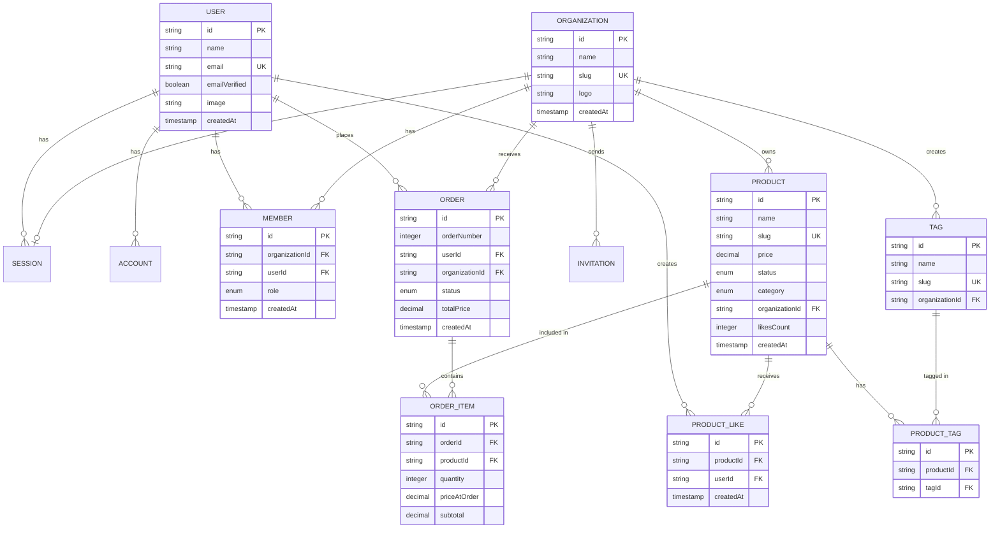

# Starva.shop

  

A modern, multi-tenant e-commerce platform. Starva.shop enables stores across various categories to showcase their products and manage orders while providing customers with a seamless shopping experience.

## Features

### For stores

- **Multi-organization support** - Manage multiple stores from a single account
- **Product management** - Create, update, and organize products with images, descriptions, and pricing
- **Order management** - Track orders through their complete lifecycle (pending → confirmed → preparing → ready → delivered)
- **Analytics dashboard** - Monitor business performance and order metrics
- **Tag system** - Categorize products for better organization and discovery
- **Inventory tracking** - Manage stock status (in stock, out of stock, archived) with automated tracking
- **Multi-category support** - Sell across various categories including health & wellness, food & groceries, clothing, real estate, electronics, and more

### For Customers

- **Browse stores** - Discover and explore different stores and their products
- **Product catalog** - Filter and search through products with tags
- **Shopping cart** - Add multiple items and place orders
- **Product likes** - Save favorite products for later
- **Order tracking** - Monitor order status in real-time
- **Order history** - View past orders and reorder easily

## Database Schema

The application uses a relational database with the following main entities:

- **Organizations**: Stores that list products
- **Products**: Items available for purchase with pricing and metadata
- **Orders**: Customer orders with status tracking
- **Order Items**: Individual products within an order
- **Users**: Customer accounts
- **Members**: Organization team members with roles
- **Tags**: Product categorization
- **Product Likes**: User favorites
- **Categories**: Product categories including health & wellness, food & groceries, clothing, real estate, electronics, appliances, furniture, books & media, automotive, toys & games, and others

### Entity Relationship Diagram

## Key Workflows

### Order Lifecycle

1. **Pending** - Order placed by customer
2. **Confirmed** - Store confirms the order
3. **Preparing** - Order is being prepared
4. **Ready** - Order ready for pickup/delivery
5. **Delivered** - Order completed
6. **Cancelled** - Order cancelled (by customer or store)

### Multi-tenant Architecture

Each organization operates independently with:

- Separate product catalogs
- Independent order management
- Team member management with roles (owner, admin, member)
- Organization-scoped analytics
- Category-specific product management

## License

MIT

## TODO

- [ ] Multiple languages, currencies
- [ ] Payment gateways
- [ ] Delivery methods
- [ ] Category-specific features ( real estate listings, service bookings, etc.)
- [ ] Advanced product specifications per category
- [ ] Multi-vendor marketplace features
