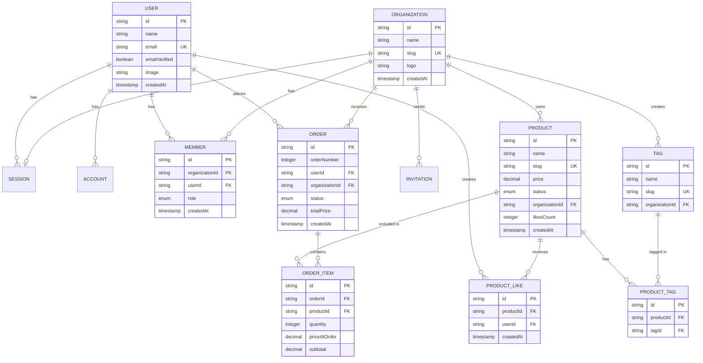

# Starva.shop

<p align="center">
  
</p>

A modern, multi-tenant food ordering platform built with Next.js. Starva.shop enables local businesses to showcase their products and manage orders while providing customers with a seamless ordering experience.

## Features

### For Businesses

- **Multi-organization support** - Manage multiple businesses from a single account
- **Product management** - Create, update, and organize products with images, descriptions, and pricing
- **Order management** - Track orders through their complete lifecycle (pending → confirmed → preparing → ready → delivered)
- **Analytics dashboard** - Monitor business performance and order metrics
- **Tag system** - Categorize products for better organization and discovery
- **Inventory tracking** - Manage stock status (in stock, out of stock, archived)

### For Customers

- **Browse businesses** - Discover and explore different businesses and their products
- **Product catalog** - Filter and search through products with tags
- **Shopping cart** - Add multiple items and place orders
- **Product likes** - Save favorite products for later
- **Order tracking** - Monitor order status in real-time
- **Order history** - View past orders and reorder easily

## Tech Stack

- **Framework**: [Next.js 16](https://nextjs.org) with App Router
- **Language**: TypeScript
- **Database**: PostgreSQL with [Drizzle ORM](https://orm.drizzle.team) and [Neon](https://neon.tech)
- **Authentication**: [Better Auth](https://better-auth.com)
- **File Uploads**: [UploadThing](https://uploadthing.com)
- **Styling**: [Tailwind CSS](https://tailwindcss.com)
- **UI Components**: [shadcn/ui](https://ui.shadcn.com)
- **State Management**: [Zustand](https://zustand.docs.pmnd.rs/getting-started/introduction)
- **Package Manager**: [pnpm](https://pnpm.io)

## Getting Started

### Prerequisites

- Node.js 18+ installed
- pnpm installed (`npm install -g pnpm`)
- PostgreSQL database (through Neon for instance)
- UploadThing account

### Installation

1. Clone the repository:

```bash
git clone <repository-url>
cd Starva.shop
```

2. Install dependencies:

```bash
pnpm install
```

3. Set up environment variables:

```bash
cp .env.example .env
```

Fill in the required environment variables:

- Database connection string
- Better Auth / Google credentials
- UploadThing API keys

4. Run database migrations:

```bash
pnpm db-push
```

5. Start the development server:

```bash
pnpm dev
```

Open [http://localhost:3000](http://localhost:3000) to view the application.

## Project Structure

```
├── app/                    # Next.js app directory
│   ├── @auth/             # Auth routes (sign-in, sign-up)
│   ├── analytics/         # Analytics dashboard
│   ├── businesses/        # Business pages and product catalogs
│   ├── orders/            # Order management
│   └── products/          # Product pages
├── components/            # React components
│   ├── businesses/        # Business-related components
│   ├── cart/              # Shopping cart components
│   ├── forms/             # Form components
│   └── orders/            # Order-related components
├── contexts/              # React contexts
├── data/                  # Data fetching functions
├── db/                    # Database schema and configuration
├── hooks/                 # Custom React hooks
├── lib/                   # Utility functions and configurations
└── server/                # Server actions
```

## Database Schema

The application uses a relational database with the following main entities:

- **Organizations**: Businesses that list products
- **Products**: Items available for purchase with pricing and metadata
- **Orders**: Customer orders with status tracking
- **Order Items**: Individual products within an order
- **Users**: Customer accounts
- **Members**: Organization team members with roles
- **Tags**: Product categorization
- **Product Likes**: User favorites

### Entity Relationship Diagram



## Key Workflows

### Order Lifecycle

1. **Pending** - Order placed by customer
2. **Confirmed** - Business confirms the order
3. **Preparing** - Order is being prepared
4. **Ready** - Order ready for pickup/delivery
5. **Delivered** - Order completed
6. **Cancelled** - Order cancelled (by customer or business)

### Multi-tenant Architecture

Each organization operates independently with:

- Separate product catalogs
- Independent order management
- Team member management with roles (owner, admin, member)
- Organization-scoped analytics

## Development

```bash
# Run development server
pnpm dev

# Run linting
pnpm lint

# Run database migrations
pnpm db-push
```

## License

MIT

## TODO

- [ ] Multiple languages, currencies
- [ ] Payment gateways
- [ ] Delivery methods
